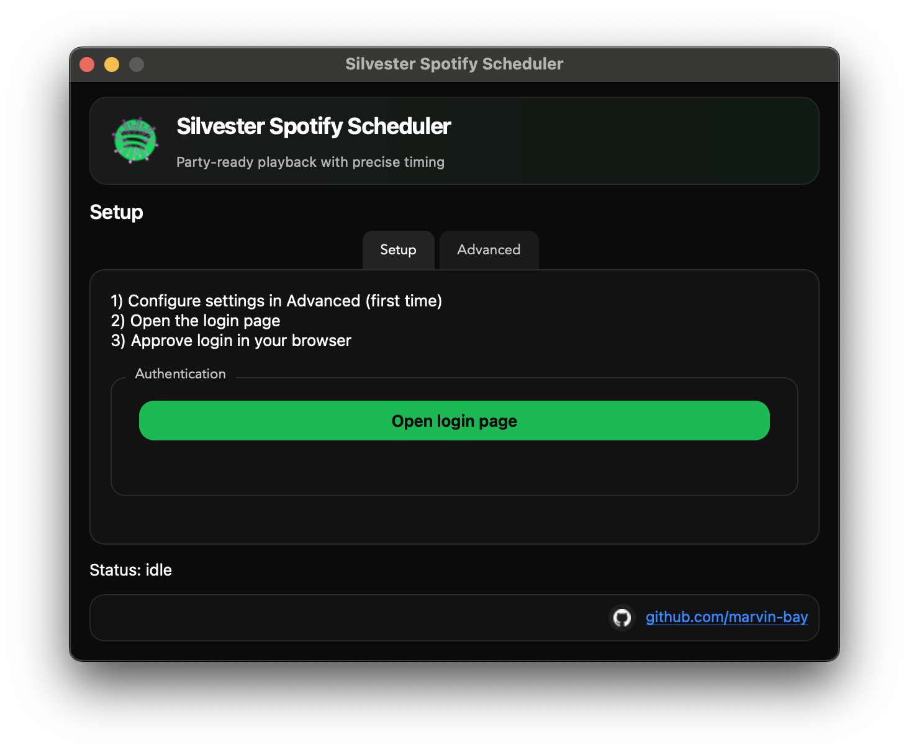
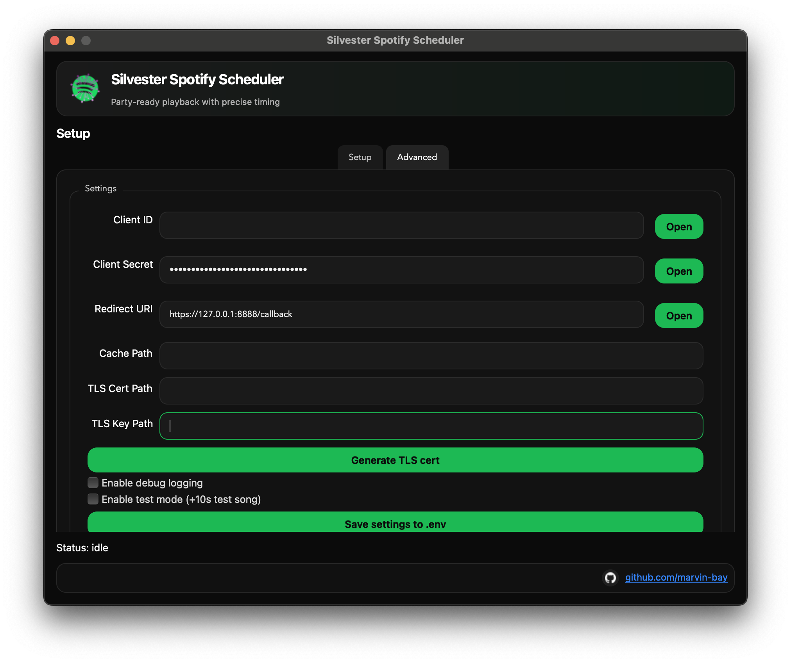
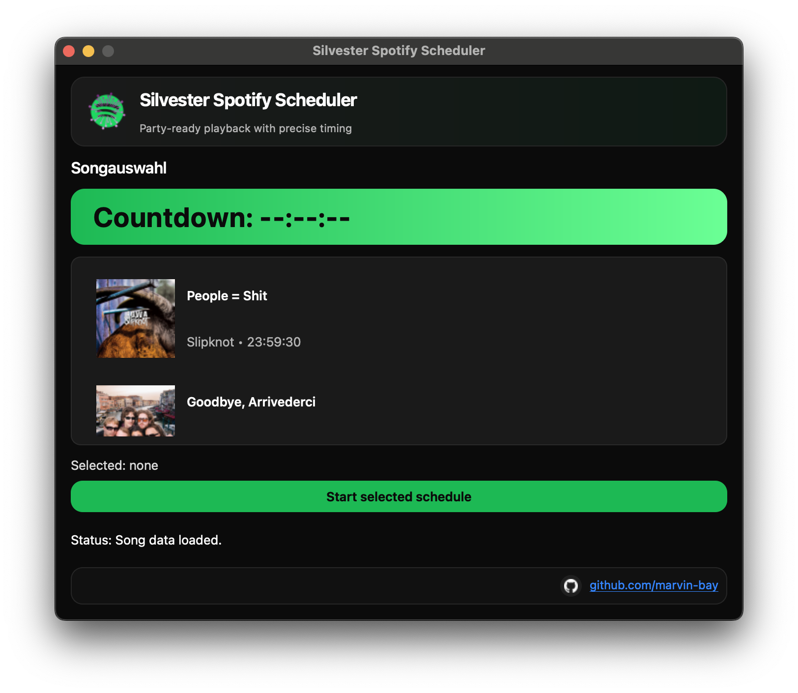

# Silvester Spotify Scheduler

A PyQt6 desktop app to authenticate with Spotify, pick a scheduled track, and fire playback at the exact time. Built for New Year’s Eve precision with a party-ready UI.

## Screenshots




## Features
- Spotify OAuth with a local HTTPS callback (no manual code copy/paste).
- Setup/Advanced tabs; `.env` is optional and auto-created.
- Song selection with countdown and album cover display.
- Playback uses queue + next to keep the current playlist going.
- Test mode to schedule a test track +10 seconds after selection.

## Requirements
- Python 3.10+ recommended
- Spotify account with playback control (Premium required by Spotify for playback control)

## Install
```
pip install -r requirements.txt
```

## Run
```
python main.py
```

## Spotify App Setup
1. Create a Spotify app at https://developer.spotify.com/dashboard
2. Add a redirect URI and save:
   - Recommended: `https://127.0.0.1:8888/callback`
3. In the app, open the Advanced tab and fill:
   - Client ID
   - Client Secret
   - Redirect URI (must match the dashboard exactly)
4. Click “Save settings to .env”.

## Authentication Flow
- Click “Open login page”.
- Approve access in the browser.
- The app receives the callback automatically and switches to song selection.

## Song Schedule
Edit `songs.py` to add schedules.
- Only the time of day is used. If the time has already passed today, it schedules for tomorrow.
- Track metadata (title/artist/cover) is fetched from Spotify by URI.

Example entry:
```
SongSchedule(
    label="Slipknot - People = Shit",
    uri="spotify:track:0Y2i84QWPFiFHQfEQDgHya",
    hour=23,
    minute=59,
    second=30,
)
```

## Test Mode
- Enable “Test mode (+10s test song)” in Advanced.
- The track with label `TEST_LABEL` appears and is scheduled +10 seconds after selection.

## Sharing With Others
In Spotify Development Mode, only users added under **User Management** can use your app.
For public use, Spotify requires an app review/production approval. Anyone can also create their own app and use their own Client ID/Secret.

## Troubleshooting
- `INVALID_CLIENT` or redirect errors: The redirect URI must match *exactly* between Spotify Dashboard and the app.
- No album covers: Check that track URIs are valid `spotify:track:` values and that your network allows image downloads.

## Security
- Do not commit `.env` or secrets. The repo includes a `.gitignore` to keep local secrets out of Git.
